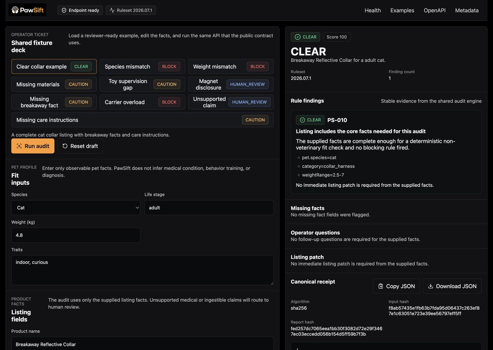

# PawSift

Know what fits before your pet finds out.

PawSift is a deterministic product-fit and listing-quality audit for non-ingestible cat and dog supplies. It returns an explainable verdict, stable rule findings, missing facts, seller copy guidance, and a content-addressed receipt.



## Live demo

- Console: [https://pawsift.vercel.app](https://pawsift.vercel.app)
- Audit endpoint: [https://pawsift.vercel.app/api/v1/audit](https://pawsift.vercel.app/api/v1/audit)
- OpenAPI: [https://pawsift.vercel.app/openapi.json](https://pawsift.vercel.app/openapi.json)

The stable Vercel alias passed the original hosted contract and desktop/mobile workflow checks on 2026-07-15. The 2026-07-17 zero-byte probe remediation is deployed and independently replayed in [`ops/OKX_REREVIEW_EVIDENCE.md`](ops/OKX_REREVIEW_EVIDENCE.md). Exact historical proof evidence remains recorded in [`ops/DEPLOYMENT.md`](ops/DEPLOYMENT.md) and `proof/proof.json`.

## One-call API

```bash
curl --fail-with-body https://pawsift.vercel.app/api/v1/audit \
  --header 'content-type: application/json' \
  --data '{
    "pet": {
      "species": "cat",
      "lifeStage": "adult",
      "weightKg": 4.8,
      "traits": ["indoor", "curious"]
    },
    "product": {
      "name": "Breakaway Reflective Collar",
      "category": "collar_harness",
      "intendedSpecies": ["cat"],
      "materials": ["nylon", "zinc_alloy"],
      "minWeightKg": 2.5,
      "maxWeightKg": 7,
      "breakaway": true,
      "careInstructions": "Hand wash and air dry.",
      "claims": ["adjustable", "reflective"]
    }
  }'
```

Valid in-scope requests return HTTP 200 with `CLEAR`, `CAUTION`, `BLOCK`, or `HUMAN_REVIEW`, plus a ruleset version and lowercase SHA-256 receipt. Medical or ingestible listing text returns HTTP 422 with deterministic `HUMAN_REVIEW` guidance. Invalid input is returned as a sanitized JSON error.

For OKX.AI's documented free-service availability check, a zero-byte `POST` also returns HTTP 200 with the deterministic clear fixture. Any non-empty body still follows the strict JSON and request-schema contract.

## Why it matters

Pet owners often see attractive listings with missing fit ranges, materials, breakaway facts, supervision guidance, or care instructions. Shopping agents need structured evidence, not an untraceable paragraph. PawSift makes those gaps explicit while giving sellers precise questions and listing patches.

## How it works

1. Zod validates a strict pet profile and product record.
2. Pure authored rules evaluate only the supplied facts.
3. Verdict precedence and penalties produce a deterministic result.
4. Canonical JSON and SHA-256 bind the request and report to a reproducible receipt.
5. The web console, examples endpoint, and OKX.AI A2MCP listing call the same engine.

Ruleset `2026.07.7` covers toys, carriers, beds, feeders, collars/harnesses, and grooming tools. It requires category-specific supported-weight facts for collars/harnesses, carriers, and beds before a listing can be marked complete, and routes generic food/treat titles to human review while preserving explicit accessory phrases only in recognized non-ingestible accessory contexts. See [Architecture](docs/ARCHITECTURE.md) for the data flow.

## Safety boundary

PawSift is not veterinary advice. It does not evaluate food, supplements, medication, pesticides, chemical treatments, symptoms, or medical suitability. `CLEAR` means no blocking or caution rule fired from the supplied facts; it never means all hazards are absent. Medical, treatment, or ingestible wording anywhere in the submitted product listing routes to `HUMAN_REVIEW`.

See [Safety](docs/SAFETY.md) for supported and excluded scope.

## Verified proof

[`proof/proof.json`](proof/proof.json) is generated from the pinned [`proof/config.json`](proof/config.json), checked-in fixture deck, and audit engine. It records the audited Git commit, each proof-critical Git blob and SHA-256 digest, exact input/report hashes, source-backed claims, verification commands, the attested PawSift deployment, and truthful `free_launch` payment mode. Export fails if a proof-critical working file differs from the pinned commit.

```bash
npm run proof
npm test -- --run tests/proof/proof.test.ts
```

The exporter does not infer the commit or public URL from `HEAD` or environment variables. Two default runs are byte-for-byte deterministic while `proof/config.json` and the audited source remain unchanged.

No sales, payment-transaction, wallet-balance, or paid-usage claim is made at launch. The separate OKX.AI identity-registration transaction is documented only as registration evidence.

## Local setup

Requirements: Node.js 22 or newer and npm.

```bash
npm ci
npm run dev
```

Open `http://localhost:3000`. Full verification:

```bash
npm run check
npm run test:e2e
npm run proof
```

## OKX.AI integration

PawSift is designed as a free A2MCP service:

- `POST /api/v1/audit` - deterministic audit endpoint
- `GET /api/v1/health` - health and ruleset metadata
- `GET /api/v1/examples` - reviewer-ready fixtures
- `GET /openapi.json` - machine contract
- `GET /.well-known/pawsift.json` - ASP metadata and safety boundary

Calling PawSift needs no wallet, private key, model key, or third-party API. Registering the ASP identity used the official Agentic Wallet flow; a paid x402 adapter is intentionally not claimed or simulated.

OKX.AI registration is complete as Agent ID `6036`. The first listing review was rejected on 2026-07-17 after the availability probe received a non-200 response. The endpoint compatibility fix is deployed and publicly verified, and the resubmission now reports `Listing under review`; the Agent remains `not listed`. No approved-listing claim is made until OKX approves it and a public listing URL is verified.

## License

PawSift is released under the [MIT License](LICENSE). Third-party notices are in [THIRD_PARTY_NOTICES.md](THIRD_PARTY_NOTICES.md).
