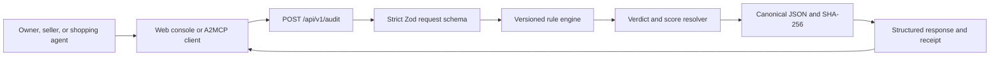

# Architecture

PawSift keeps the decision path small, deterministic, and independent from browser state or external AI services.

## Layers

### Domain

- `src/domain/schemas.ts` defines strict request, response, finding, and receipt contracts.
- `src/domain/rules.ts` holds authored rules with stable IDs and ruleset version `2026.07.7`.
- `src/domain/audit.ts` resolves findings, verdict precedence, score, missing facts, questions, patches, and receipt hashes.
- `src/domain/canonical-json.ts` sorts object keys recursively and rejects non-JSON values.
- `src/domain/fixtures.ts` is the shared reviewer and test fixture deck.

The rule engine scans every product-listing text field for unsupported medical or ingestible scope, with explicit non-ingestible accessory exceptions. Category-specific completeness requires both weight bounds for collars/harnesses and a maximum supported weight for carriers and beds.

The domain layer is pure except for SHA-256 hashing. It does not read environment variables, call a model, access a wallet, or perform network I/O.

### HTTP

- `POST /api/v1/audit` validates content type, size, JSON, and the request schema before calling the domain engine.
- `GET /api/v1/health` exposes liveness and ruleset metadata.
- `GET /api/v1/examples` publishes the checked-in fixtures.
- `GET /openapi.json` publishes the machine contract.
- `GET /.well-known/pawsift.json` publishes A2MCP discovery metadata.

Stable JSON error codes isolate clients from framework errors. Stack traces and correlation internals are not returned.

### Web console

`components/AuditConsole.tsx` loads the examples endpoint, owns draft state, calls the same audit route used by agents, and prevents late fixture responses from overwriting user edits. Result components render findings, remediation, and the complete canonical receipt. Downloaded JSON includes the exact canonical input and report preimages needed to verify both hashes.

### Evidence

`src/proof/proof.ts` rebuilds all fixture outcomes and validates every stored hash. `scripts/export-proof.ts` adds the audited git commit and commit timestamp, then writes `proof/proof.json`. The file remains deterministic for a fixed commit and deployment URL.

## Trust model

PawSift proves that a given structured request produced a specific deterministic report under a named ruleset. It does not prove that seller-supplied facts are true, that a physical product matches its listing, or that a product is medically safe.

## Deployment

The Next.js application is designed for Vercel. The launch A2MCP endpoint is free and requires no secret. `PAWSIFT_PUBLIC_URL` is used only during proof export after a real HTTPS deployment passes hosted checks.
